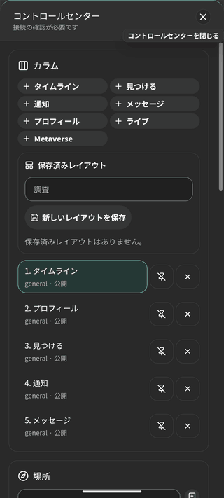
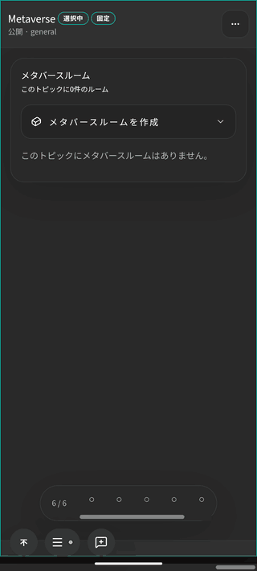
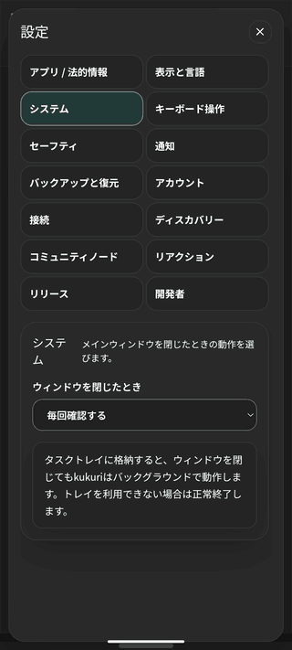
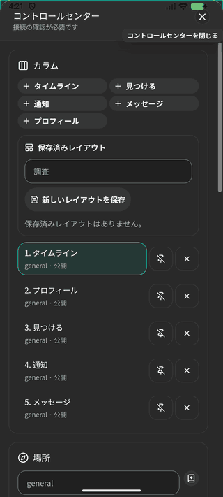
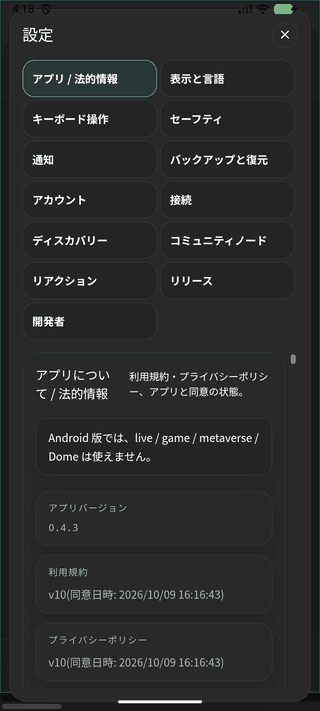

# #1198 AC-1 Android の Tauri WebView での SNS の主要導線（2026-10-10）

#1198 の AC-1（PR-A5-1）の記録。Scope revision `2026-10-10-r6`、基準 commit `da0835efe`（#1194 AC-2 の merge 後の `integration/android-1193`）。前提の判断は #1193 の D1・D7 と、2026-10-10 のユーザー判断（#1198 の Current status。ファイル・起動中の OS 通知・link からの起動・移行 QR のカメラの実機確認は #1197 AC-1〜5 が担当し、検索・発見は索引の無い試験用 CN での表示で判定する）。

## 入口と設定の変更

| 対象 | 変更前（`da0835efe`） | 変更後 |
| --- | --- | --- |
| live・game・metaverse・Dome の入口 | desktop と同じく開発者モードのときだけ出る。開発者モードを有効にすると、コントロールセンターに「ライブ」「Metaverse」の列の追加が出て、Metaverse の列から「メタバースルームを作成」まで進めた | Web と同じく開発者モードでも出さない。`#/live`・`#/game` の URL は topic のタイムラインへ落ちる |
| 設定の「システム」（ウィンドウを閉じたときの動作・タスクトレイ） | Android でも出て、タスクトレイに格納する設定と説明が出た | 出さない |
| 設定の About | Android の説明は無い | 「Android 版では、live / game / metaverse / Dome は使えません。」（en・zh-CN も同じ意味） |

判定は build 時の flag。Tauri CLI（2.12.0）は Android の build・dev で、build の前の command（Vite）に `TAURI_ENV_PLATFORM=android` を渡す（`tauri android build` の Vite の設定の読込みで確認）。`vite.config.ts` の `envPrefix` で画面へ渡し、`apps/desktop/src/lib/platform.ts` の `IS_ANDROID` にする（#1197 AC-1 も同じ判定を使う）。userAgent は Web 版を Android の Chrome で開いた場合と区別できないので使わない。

| 変更前 | 変更後 |
| --- | --- |
|    |   |

## 実機での確認の条件

- 端末: emulator（AVD `Medium_Phone_API_36.1`、x86_64、Android 16（API 36.1）、WebView 134.0.6998.135、411×914 CSS px）。AVD の既定の RAM（2 GB）では、host で build している間と同意の直後に app の ANR が出た（main thread が tao の `onWindowFocusChanged` の JNI で待ち、kswapd と kcompactd が動いていた）。AVD の設定は変えず、起動の option で `-memory 4096 -gpu swiftshader_indirect -no-window` とした。この条件では下の操作の間に ANR は出ていない。
- app: 変更後の debug APK（x86_64、`CARGO_PROFILE_DEV_DEBUG=line-tables-only`）。`pm clear` の後の初回起動から操作した。
- Community Node: 試験用（harness の `web_e2e_fixture`。専用の Postgres・valkey の container、`adb reverse` で CN と relay の port を届かせた。索引は提供しない）。本番の CN には同意していない。
- 相手の端末: 同じ fixture の native の runtime（表示名 Desktop Peer）。操作は fixture の `/fixture/invoke`。
- 操作の方法: 画面の要素の位置を WebView の DevTools（CDP）で読み、`adb shell input tap` で押した。文字は `adb shell input text`（ASCII。日本語の変換は AC-2）。画面は emulator の console で撮った。

## 操作表

| # | 導線 | 操作 | 結果 | 画面 |
| --- | --- | --- | --- | --- |
| 1 | 同意 | 初回起動 → 言語で日本語を選ぶ → 18 歳以上を確認 → 同意して続行 | 同意画面が日本語に切り替わり、同意の後に shell とコミュニティノードの案内が出た | [01](2026-10-10-1198-android-sns-flows-evidence/01-consent.png) |
| 2 | Community Node | 案内の「コミュニティノード設定を開く」→ ベース URL を試験用 CN に替えて保存 → 同意状況 → 同意する | 規約 6 件を表示し、同意の後に認証済み（`authenticated: true`） | [02](2026-10-10-1198-android-sns-flows-evidence/02-community-node.png) |
| 3 | profile | 初回のプロフィールの設定で表示名・ユーザー名・自己紹介を入れて保存 | `get_my_profile` と相手の端末に反映された。画像は #1197 AC-1・AC-2 | [03](2026-10-10-1198-android-sns-flows-evidence/03-profile.png) |
| 4 | topic の発見 | コントロールセンターで topic の名前を入れて追加。「見つける」の「発見」→ 結果を表示 | 追加した topic のタイムラインの列が開いた。発見は「選択したコミュニティノードではコミュニティ索引が設定されていません。」と「状態を再確認」「コミュニティノード設定を開く」を示した | [04](2026-10-10-1198-android-sns-flows-evidence/04-discovery.png) |
| 5 | 投稿 | general の「投稿」→ 本文 → 投稿 | 自分のタイムラインに出て、相手の端末に約 5 秒で届いた。相手の投稿も約 5 秒で届いた | [05](2026-10-10-1198-android-sns-flows-evidence/05-post.png) |
| 6 | 返信 | 相手の投稿の「返信」→ 本文 → 返信 | スレッドに出て、相手の端末のスレッドにも届いた | [06](2026-10-10-1198-android-sns-flows-evidence/06-reply.png) |
| 7 | 反応 | 相手の投稿の「リアクション」→ 👍 | 👍 1 が出て、相手の端末の投稿にも 👍 1 | [07](2026-10-10-1198-android-sns-flows-evidence/07-reaction.png) |
| 8 | DM | 相手のプロフィールの「フォロー」、相手からも follow → 出た「メッセージ」→ 送信。相手から返信 | 両方向で届き、どちらも「配信済み」 | [08](2026-10-10-1198-android-sns-flows-evidence/08-dm.png) |
| 9 | 非公開チャンネル | 「チャンネル作成・参加」で招待限定のチャンネルを作る →「設定と共有」→「共有リンク作成」→「共有リンクをコピーする」→ 相手が取り込む → それぞれ投稿 | コピーは「クリップボードにコピーしました。」。相手の端末ではチャンネルの範囲にだけ出て、公開のタイムラインには出ない。相手の投稿は「新しい投稿を1件表示」として出て、押すと表示された | [09](2026-10-10-1198-android-sns-flows-evidence/09-private-channel.png) |
| 10 | 検索 | 「見つける」の「検索」で語を入れて結果を表示 →「状態を再確認」→「コミュニティノード設定を開く」 | 「…コミュニティ索引が設定されていません。」と案内を示し、設定のコミュニティノードへ移った。結果の一覧は desktop・browser と共通の部品の既存の試験を根拠にする | [10](2026-10-10-1198-android-sns-flows-evidence/10-search.png) |
| 11 | 通報・ブロック | 相手の投稿とプロフィールの「通報」。プロフィールの「ブロック」→ タイムライン →「ブロック解除」 | 通報は「通報先を特定できません」と理由を示し、ミュート・ブロックを選べた（試験用 CN は表示・索引に関与していないので送信先が決まらない）。ブロックの間は相手の投稿がタイムラインから消え、解除で戻った | [11a](2026-10-10-1198-android-sns-flows-evidence/11-report.png) [11b](2026-10-10-1198-android-sns-flows-evidence/11-block.png) |
| 12 | 設定・backup | 設定の各 section を開く。アカウントで鍵を書き出す | どの section にも到達できた。「システム」は無く、About に一文が出た。アカウント鍵の書出しは暗号化した文字列（`kukuri-account-key.v1.…`）で完結した。backup・鍵のファイル・診断の書出しのファイルは #1197 AC-1 | [12](2026-10-10-1198-android-sns-flows-evidence/12-key-export.png) |
| 13 | 使えない機能 | 開発者モードを有効にしてコントロールセンターを開く。`#/live`・`#/game` を開く | 列の追加はタイムライン・見つける・通知・メッセージ・プロフィールだけ。live・game の URL は topic のタイムラインへ | [変更後](2026-10-10-1198-android-sns-flows-evidence/after-control-center-devmode.png) |
| 14 | 欠損・取得待ち | CN への転送を外す → 検索・投稿 → 戻す。fixture（相手・CN・relay）を止めて DM と投稿 | CN に届かない間は「コミュニティノードを利用できません」「ダイレクト P2P 接続は引き続き利用できます」「再試行を待っています」と示し、投稿は相手に約 5 秒で届いた。転送を戻すと約 15 秒で「接続済み」に戻った。相手が居ない間の DM は「送信待ち」と示し、投稿と画面の移動はそのまま使えた | [13a](2026-10-10-1198-android-sns-flows-evidence/13-cn-unreachable.png) [13b](2026-10-10-1198-android-sns-flows-evidence/13-dm-pending.png) |

- 14 の DM の画面のうち「DM sent while offline」「DM while fully disconnected」は、機内モードと `adb reverse` の規則の削除の間に送ったもので、既に張られていた relay への接続を通って届いた（「配信済み」は正しい）。他の session も adb を使うので、adb の server の再起動で接続を切ることはしていない。相手が居ない状態は fixture を止めて作った。

## 件数に比例する待ちが無いこと

同じ topic の投稿を 100 件と 1,000 件にして、WebView の再読込みから表示中のタイムラインの列が描かれるまでと、その後の 1 回の scroll で、Tauri の IPC（`window.ipc.postMessage` と応答の callback を記録用に包んで観測）と描画した投稿の数を比べた。

| 投稿数 | タイムラインの取得（表示中の列） | scroll で増えた取得 | 描画した投稿 | 最初の投稿が出るまで（同じ状態で交互に 3 回） |
| --- | --- | --- | --- | --- |
| 100 | limit 20・cursor 無しで 20 件 | limit 20・cursor 付きで 20 件を 1 回 | 20 → 40 | 1,685・2,687・1,572 ms |
| 1,000 | limit 20・cursor 無しで 20 件 | limit 20・cursor 付きで 20 件を 1 回 | 20 → 40 | 1,827・2,069・1,759 ms |

- どちらも、タイムラインの取得はすべて limit 20 で、全件を読む呼出しは無い。他の列（general・チャンネル等）の取得も limit 20 の 1 page。
- IPC の総数（再読込みで 59〜77 回）は、開いている他の列と背景の更新の時機で揺れ、件数で増える呼出しは無かった。1,000 件の側の scroll の後に多かったのは、開いていたプロフィールの列が描き直しのたびに呼ぶ `list_author_trust_display_exceptions` で、タイムラインの件数とは関係しない。
- 900 件を作った直後の 1 回目は、件数の少ない他の topic の取得まで同じ割合で遅く（最初の投稿まで 4.2 s）、背景の処理が落ち着いてからの測り直しを上の表に載せた。

## 担当外の観測（引継ぎ）

| 観測（`b4b43bdc5` の build、emulator） | 担当 |
| --- | --- |
| 設定の「通知」の状態が「利用不可。デスクトップの通知サービスとOS設定を確認してください」（OS 通知は #1197 AC-4 まで `unavailable`） | #1197 AC-4（許可の状態の表示） |
| 設定の「リリース」が「更新に失敗しました」と `update_managed_by_google_play` を示し、「確認」「インストール」と GitHub の更新の送信先（30 分ごと）の行が出る | #1199 AC-3（Play の更新の表示。PR #1725 で対応中） |
| backup の作成・復元、鍵のファイルの取込み、診断の書出し、画像・動画の添付、link からの起動、移行 QR のカメラ | #1197 AC-1〜5（AC-1 は PR #1728 で対応中） |
| 画面の上端が status bar と重なる。幅 411px で設定のコミュニティノードの操作の列の「トークンをクリア」の文字がボタンの幅からはみ出す（各ボタンの中心はそのボタンが受ける）。Pixel 8 Pro（448px）で設定の「リリース」のリンクの行の文字が重なる（#1197 AC-1 の session の観測） | #1198 AC-3 |

- 投稿欄を開いた直後（入力欄に focus が無い間）は、左下の操作群（アカウント・コントロールセンター・フィードバック）が送信ボタンの左側に重なる。入力欄を tap すると操作群は隠れ、送信ボタンの中央は常に送信ボタンが受ける。Web 版と共通の CSS（`mobile-column-workspace.css` の `:focus-within`）による挙動で、本 AC では変えていない。
- プロフィールの通報の dialog の説明が「この投稿の表示・索引…」となっている（共通の文言）。
- 相手の非公開チャンネルへの投稿は、Android に届くまで約 1 分かかった（公開の投稿は約 5 秒）。
