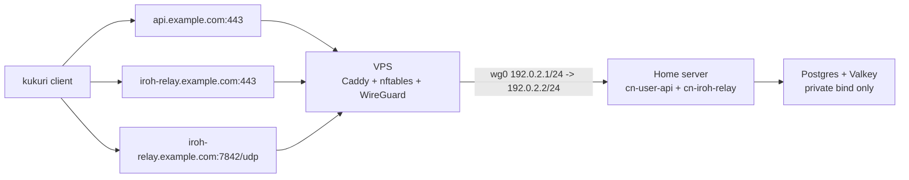

# Community Node Self-Host With VPS Edge

最終更新日: 2026-10-04

## 目的

- community-node の公開経路を `WireGuard + Caddy` の VPS edge に一本化する。
- `cn-user-api`, `cn-iroh-relay`, Postgres, Valkey は Home 側に置く。
- VPS は public IP, DNS, TLS termination, UDP forward だけを担当する。
- Public contract は operator が所有する `https://api.example.com` と `https://iroh-relay.example.com`

## 構成



例示値（`example.com` domain は operator の実値への置換必須）:

- WireGuard subnet: `192.0.2.0/24`
- VPS tunnel IP: `192.0.2.1`
- Home tunnel IP: `192.0.2.2`
- Public API domain: `api.example.com`（operator が所有する実 domain へ置換）
- Public iroh relay domain: `iroh-relay.example.com`（operator が所有する実 domain へ置換）
- Public WireGuard port: `51820/udp`
- Public iroh relay QUIC port: `7842/udp`

## VPS 側

DNS と firewall:

- `api.example.com` と `iroh-relay.example.com`（いずれも実 domain へ置換）を VPS の public IP に向ける。
- Cloudflare を使う場合は DNS only にする。
- VPS / cloud firewall で `22/tcp`, `80/tcp`, `443/tcp`, `51820/udp`, `7842/udp` を許可する。

セットアップ:

```bash
git clone https://github.com/<your-org>/kukuri.git
cd kukuri
cp scripts/vps/community-node-edge.env.example scripts/vps/community-node-edge.env
```

`scripts/vps/community-node-edge.env` の必須値:

```dotenv
PUBLIC_IFACE=eth0
WG_ENDPOINT_HOST=api.example.com
WG_VPS_ADDRESS=192.0.2.1/24
WG_HOME_CLIENT_ADDRESS=192.0.2.2/24
WG_HOME_ALLOWED_IPS=192.0.2.2/32
HOME_WG_IP=192.0.2.2
WG_SERVER_PRIVATE_KEY=<vps-private-key>
WG_HOME_PUBLIC_KEY=<home-public-key>
WG_HOME_PRESHARED_KEY=<shared-psk>
API_DOMAIN=api.example.com
IROH_RELAY_DOMAIN=iroh-relay.example.com
HOME_CN_USER_API_PORT=18080
HOME_IROH_RELAY_HTTP_PORT=13340
HOME_IROH_RELAY_QUIC_PORT=7842
```

実行:

```bash
sudo ./scripts/vps/setup-community-node-edge.sh scripts/vps/community-node-edge.env
```

生成物:

- `/etc/wireguard/wg0.conf`
- `/etc/caddy/sites-enabled/kukuri-community-node-edge.caddy`
- `/etc/nftables.conf`
- `/root/wg0-home-client.conf`

Caddy は `api.example.com -> http://192.0.2.2:18080` と `iroh-relay.example.com -> http://192.0.2.2:13340` を reverse proxy する。domain は operator の実値へ置換する。`7842/udp` は Caddy を通さず nftables で Home 側へ DNAT する。

## Home 側

WireGuard:

VPS 側が生成した `/root/wg0-home-client.conf` を Home 側へコピーし、`PrivateKey` を埋めて `/etc/wireguard/wg0.conf` として配置する。

```ini
[Interface]
Address = 192.0.2.2/24
PrivateKey = <home-private-key>

[Peer]
PublicKey = <server-public-key>
PresharedKey = <same-as-WG_HOME_PRESHARED_KEY>
Endpoint = api.example.com:51820
AllowedIPs = 192.0.2.1/32
PersistentKeepalive = 25
```

起動:

```bash
sudo systemctl enable --now wg-quick@wg0
```

`.env.community-node`:

```dotenv
CN_BASE_URL=https://api.example.com
CN_PUBLIC_BASE_URL=https://api.example.com
COMMUNITY_NODE_CONNECTIVITY_URLS=https://iroh-relay.example.com

CN_POSTGRES_HOST_BIND_IP=127.0.0.1
CN_VALKEY_HOST_BIND_IP=127.0.0.1
CN_USER_API_HOST_BIND_IP=192.0.2.2
CN_USER_API_PORT=18080
CN_IROH_RELAY_HTTP_HOST_BIND_IP=192.0.2.2
CN_IROH_RELAY_PORT=13340
CN_IROH_RELAY_QUIC_BIND_ADDR=0.0.0.0:7842
CN_IROH_RELAY_QUIC_HOST_BIND_IP=192.0.2.2
CN_IROH_RELAY_QUIC_PORT=7842
CN_IROH_RELAY_TLS_CERT_PATH=/certs/default.crt
CN_IROH_RELAY_TLS_KEY_PATH=/certs/default.key
CN_IROH_RELAY_CERTS_HOST_PATH=./docker/cn/certs
```

`CN_POSTGRES_PASSWORD` と `COMMUNITY_NODE_JWT_SECRET` は必ず本番用の値に変える。Postgres と Valkey は public に bind しない。

## iroh relay 証明書

`cn-iroh-relay` の `7842/udp` は Home 側コンテナが直接応答するため、`iroh-relay.example.com`（実 domain）用の証明書と秘密鍵を Home 側へ置く。

VPS 上で Caddy の証明書を探す:

```bash
sudo find /var/lib/caddy/.local/share/caddy/certificates -path '*iroh-relay.example.com*'
```

Home 側へ配置:

```bash
mkdir -p docker/cn/certs
cp /path/to/iroh-relay.example.com.crt docker/cn/certs/default.crt
cp /path/to/iroh-relay.example.com.key docker/cn/certs/default.key
```

## STUN（3478/udp）を提供しない

Web 版のクライアントは、WebRTC の直接経路の候補（server reflexive）を得るため、relay の host の `3478/udp` へ STUN の要求を送る（ADR 0057 §6）。
STUN は要求の送信元の address を見て返すので、VPS で送信元を書き換えて（masquerade）Home へ転送するこの構成では、Home の `cn-stun` は VPS の address しか返せない。
このため VPS edge 構成では STUN を提供しない。VPS の firewall で `3478/udp` を開けず、Home の `CN_STUN_HOST_BIND_IP` は既定の loopback のままにする（service を指定せずに `up` しても外からは届かない）。

STUN が無いときのクライアントの挙動:

- WebRTC の交渉は server reflexive の候補なしで進む。ブラウザは候補集めで最大 3 秒、desktop はブラウザからの交渉に応じるとき 500 ms 待つ。
- NAT の内側同士では直接経路が成立しにくく、relay（Relay Fallback）で通信する。通信の機能は失われない。
- native 同士の通信は STUN を使わないので変わらない。

## 起動

```bash
docker compose --env-file .env.community-node -f docker-compose.community-node.yml run --rm cn-migrate
docker compose --env-file .env.community-node -f docker-compose.community-node.yml up -d --build cn-user-api cn-iroh-relay
```

index / moderation stack（cn-indexer + ArcadeDB + relation 定期解析。#615）も含めて起動する場合は
service を指定せず `up -d --build` する。ArcadeDB / cn-indexer は host へ port を公開しない
（indexer の status endpoint のみ loopback bind）。provider / secrets の env と運用手順は
`.env.community-node.example` のコメントと `docs/runbooks/community-node-gcp-terraform.md` の
「index / moderation stack のデプロイ」を参照する。

## 入会制御（招待 / whitelist / ban） — #383

public node の利用者を限定する場合、`cn-cli admission` で運用する。mode は DB（`cn_admin.service_configs`）に保存され runtime 可変なので、`.env.community-node` の変更や再起動は不要。

mode の意味:

- `open`（既定）: 署名できる誰でも参加できる。既存挙動と同じ。
- `invite`: 未登録の参加者は有効な招待コードが必要。allowlist 済みの pubkey はコード不要で参加できる。
- `whitelist`: allowlist 済みの pubkey のみ参加できる。

いずれの mode でも、既に参加済み（active）の利用者は mode 変更後も再認証を通る。ban された pubkey は mode に関わらず参加できず、既存トークンも即時失効する。

> 注意: ここでの ban は kukuri network 全体からのアカウント凍結ではなく、この node が提供する接続補助・auth/consent をこの pubkey へ提供しないという node-local な制限である（`docs/architecture/p2p-first-community-node-responsibility-boundary.md`）。

`cn-cli` は `COMMUNITY_NODE_DATABASE_URL` を参照する。docker compose 環境では `cn-user-api` と同じ DB を指す。

```bash
# 現在の mode を確認
docker compose --env-file .env.community-node -f docker-compose.community-node.yml run --rm \
  cn-cli admission show

# 招待制に切り替える
docker compose --env-file .env.community-node -f docker-compose.community-node.yml run --rm \
  cn-cli admission set-mode --mode invite

# 招待コードを発行する（平文はこのとき一度だけ表示される。max-uses / expires-at は任意）
docker compose --env-file .env.community-node -f docker-compose.community-node.yml run --rm \
  cn-cli admission invite issue --label friends --max-uses 5 --expires-at 2026-12-31T00:00:00Z

# 招待コードの一覧（hash のみ）と取り消し
docker compose --env-file .env.community-node -f docker-compose.community-node.yml run --rm \
  cn-cli admission invite list
docker compose --env-file .env.community-node -f docker-compose.community-node.yml run --rm \
  cn-cli admission invite revoke --code <plaintext-code>

# 手動許可（whitelist）
docker compose --env-file .env.community-node -f docker-compose.community-node.yml run --rm \
  cn-cli admission allow add --pubkey <hex-pubkey> --label trusted
docker compose --env-file .env.community-node -f docker-compose.community-node.yml run --rm \
  cn-cli admission allow list

# ブラックリスト（ban）
docker compose --env-file .env.community-node -f docker-compose.community-node.yml run --rm \
  cn-cli admission ban add --pubkey <hex-pubkey>
docker compose --env-file .env.community-node -f docker-compose.community-node.yml run --rm \
  cn-cli admission ban remove --pubkey <hex-pubkey>
```

クライアントは、招待が必要なノードへ未登録の公開鍵で接続して `POST /v1/auth/verify` から HTTP 403（`INVITE_REQUIRED` / `INVITE_INVALID` / `INVITE_EXPIRED` / `INVITE_EXHAUSTED` / `INVITE_REVOKED` / `NOT_ALLOWLISTED` / `BANNED`）を受けると、自動再試行を止め、対象ノードの設定欄に理由と次の操作を表示する。

招待関連の理由では、そのノード専用の招待コードを入力して再認証できる。招待コードはノードごとに端末内へ保存し、別のノードへ送信しない。`NOT_ALLOWLISTED` と `BANNED` ではノード運営者への連絡を案内する。画面へ招待コードそのものは戻さず、保存済みかどうかだけを表示する。

## 確認

VPS:

```bash
sudo wg show
sudo systemctl status wg-quick@wg0
sudo systemctl status caddy
sudo nft list ruleset
curl -fsS https://api.example.com/healthz
curl -fsS https://iroh-relay.example.com/ping
```

Home:

```bash
ip addr show wg0
ss -ltnup | grep -E '(:18080|:13340|:7842)'
docker compose --env-file .env.community-node -f docker-compose.community-node.yml ps
```

期待値:

- `https://api.example.com/healthz`（実 domain）が成功する。
- `https://iroh-relay.example.com/ping`（実 domain）が成功する。
- Home 側の `18080/tcp`, `13340/tcp`, `7842/udp` は `192.0.2.2` に bind される。
- desktop client は `Save Nodes -> Authenticate -> Accept` 後、`connectivity_urls` として operator の relay URL（例: `https://iroh-relay.example.com`）を受け取る。
