# 2026-09-20 コミュニティノード規約の提示場所と順序

- Status: current
- Supersedes: None
- Superseded by: None
- PR: [#1238](https://github.com/kukuri-app/kukuri/pull/1238)
- Issue / Scope revision: [#1192](https://github.com/kukuri-app/kukuri/issues/1192)、2026-09-20
- Preview: 下表の before / after 画像（`assets/1192/`）
- 対象 surface / 利用者 / 目的: コミュニティノードの規約 Dialog（初回起動の案内・設定・見つける・コントロールセンターから開く共通 Dialog）、権利侵害申請モーダル、コントロールセンターのシステム欄、「見つける」カラム。ノードへ初めて同意する人、規約を読み直したい人、権利侵害を申し出る人が対象。文書をその文書が必要になる場所で提示する。
- 変更分類: 既存画面の改善（ADR 0014 §2）。ただし同意の提示内容と受諾対象が変わるため、リスク区分は C（同 §3）。

## 採用した表示

### 同意 Dialog

文書ごとの「必須 / 任意」バッジを外した。一覧の文書は 1 つの同意ボタンでまとめて受諾するため、バッジが示す区別が操作上どこにも現れず、任意と書かれた文書も断れない見た目になっていた。版・同意状況・更新バッジは残す。

一覧の順序を 利用規約 → プライバシーポリシー → 残り（ノード応答の順＝slug 昇順）に固定した。変更前は slug 昇順だけで、利用規約が末尾、プライバシーポリシーが 5 番目に来ていた。

権利侵害申出ポリシーを一覧から外した。この文書は権利侵害を申し出るときだけ必要で、接続の同意対象ではない。ただし operator が `required: true` を設定した場合は外さない（外すと必須同意が到達不能になりノードへ接続できなくなる）。

受諾時に送信する文書を「表示した文書」から導くようにした。変更前は取得したカタログ全件を送っていたため、#1061 で一覧から外した観測提供の文書も同意記録に入っていた。

### 権利侵害申請モーダル

理由に「著作権・プライバシー・商標などの権利侵害」を選ぶと、選択中のノードの権利侵害申出ポリシーを折りたたみで提示する。見出し行に版と施行日を置き、本文は展開時だけ Markdown として描画する。ここは読み取りだけで、同意操作は持たない。申出は従来どおり外部の申出画面へ進み、`scope_acknowledged` はそちらで扱う（ADR 0033 §2）。取得中・取得失敗・ポリシー未公開の 3 状態を持ち、いずれでも申出画面への導線は残る。

### コントロールセンター

システム欄の「コミュニティノード」の下に、設定済みノードを一覧で置いた。各行はノード名（manifest の node_name、無ければベース URL）、同意状態バッジ、「同意状況」ボタンで構成する。ボタンは行ごとに対象ノードを固定して同じ規約 Dialog を開く。ノード横断の一括操作は置かない。設定画面を開く既存ボタンは残した。

### 「見つける」カラム

カード内の「コミュニティインデックス」見出しと直下の説明文を外した。カラム見出しが既に「見つける」を示しており、カードの見出しは同じ領域を二重に説明していた。トピック内のコミュニティインデックスカードは、カラム見出しと文言が異なるため従来どおり残す。

## 条件と証跡

- Platform: Chromium（Playwright、mock runtime）。Windows WebView2 実機は未確認（下記）。
- Viewport: 1280×900 と 390×900（撮影）。自動テストは 1280×800 と 390×800。
- Theme: dark と light。
- Locale: ja（撮影）。自動テストは ja / en / zh-CN。
- State: 未同意の 7 文書（cn-operator のサンプル config と同じ構成）、一部同意済み、同意済み、取得失敗、権利侵害ポリシーの折りたたみ・展開、ノード 0 件。

| 条件 | 変更前 | 変更後 |
| --- | --- | --- |
| 同意 Dialog（ja / dark / 1280px） | 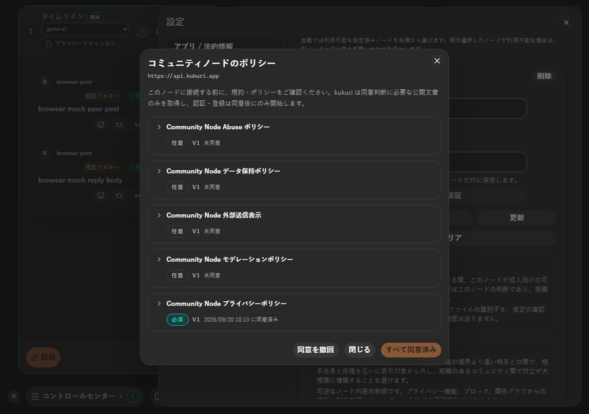 | 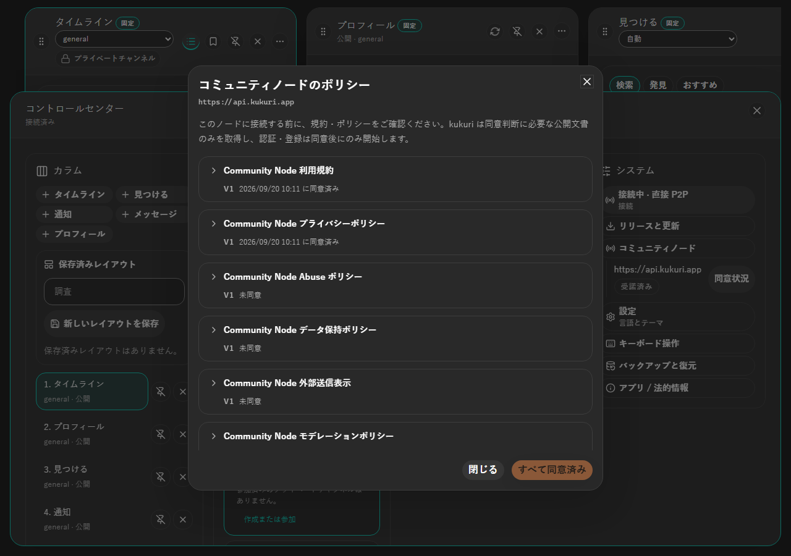 |
| 同意 Dialog（ja / light / 390px） | 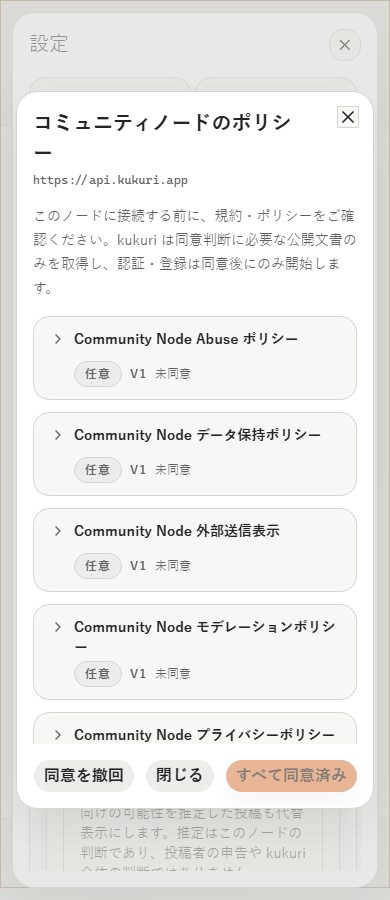 | 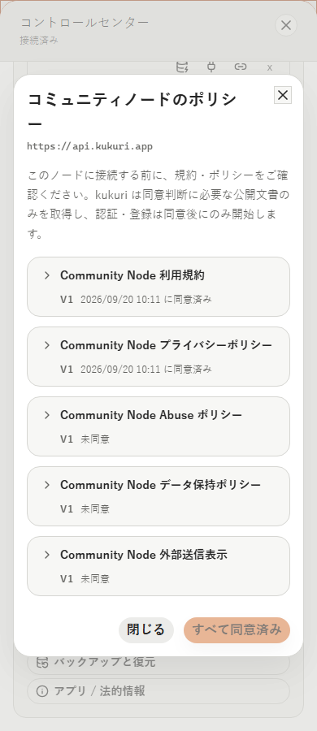 |
| 「見つける」カラム（ja / dark / 1280px） | 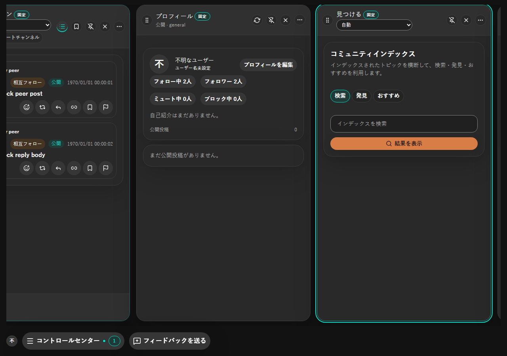 | 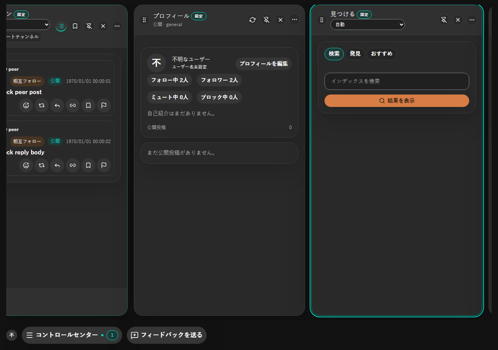 |
| 「見つける」カラム（ja / dark / 390px） | 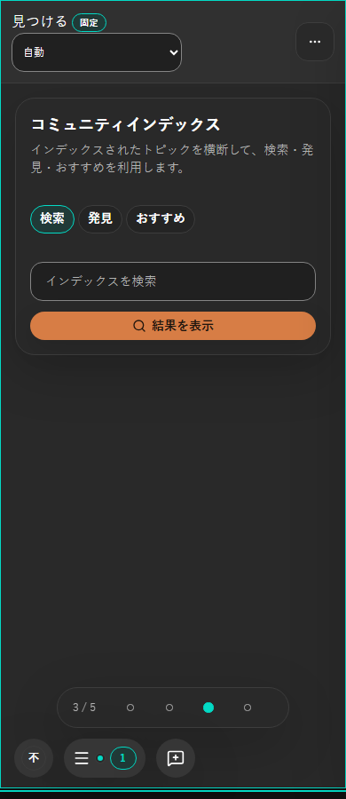 | 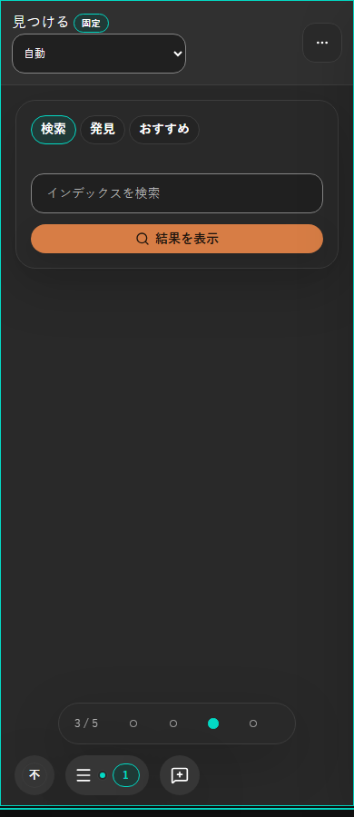 |
| コントロールセンター（ja / dark / 1280px） | 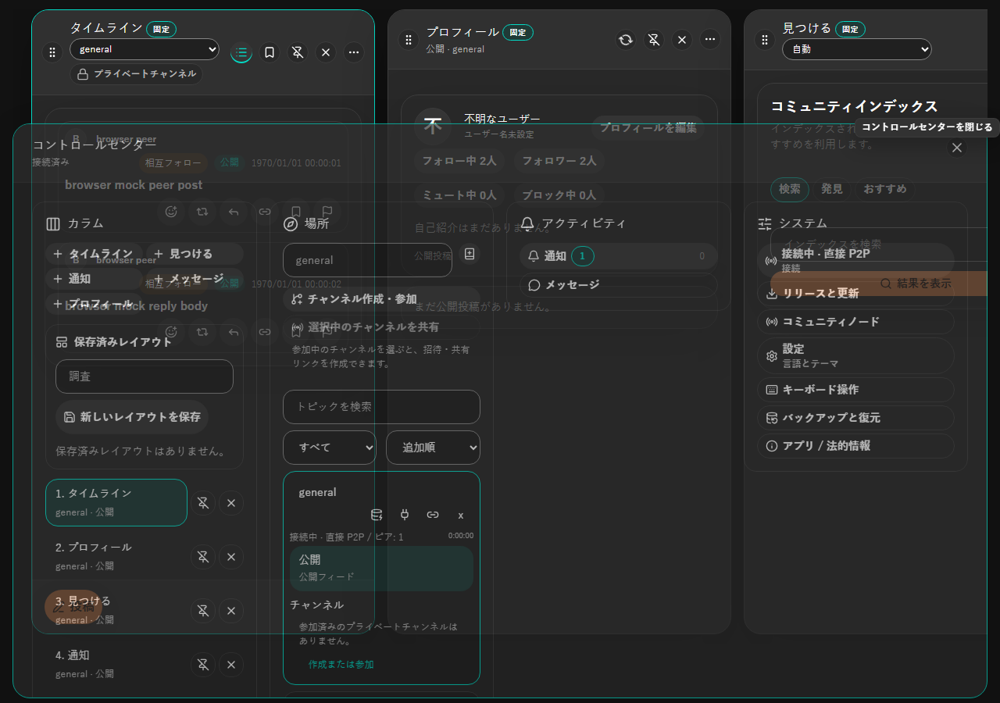 | 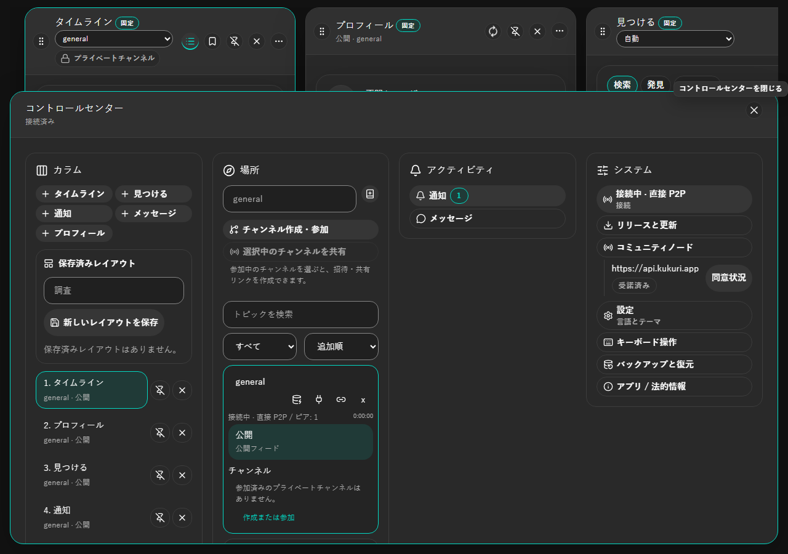 |
| 権利侵害申請モーダル（ja / dark / 1280px） | 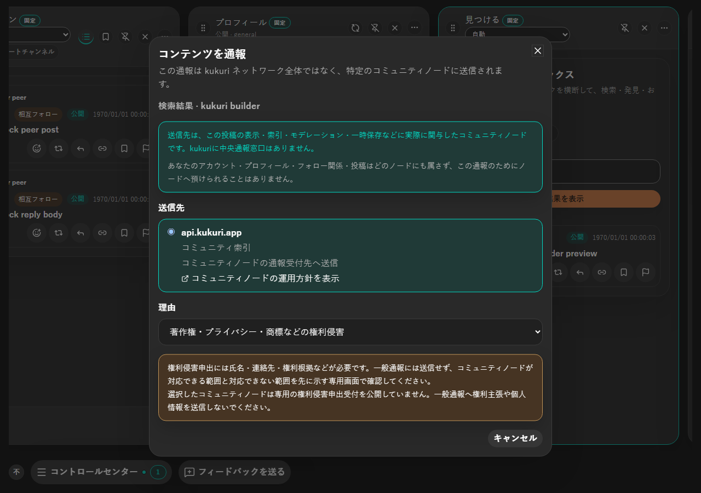 | 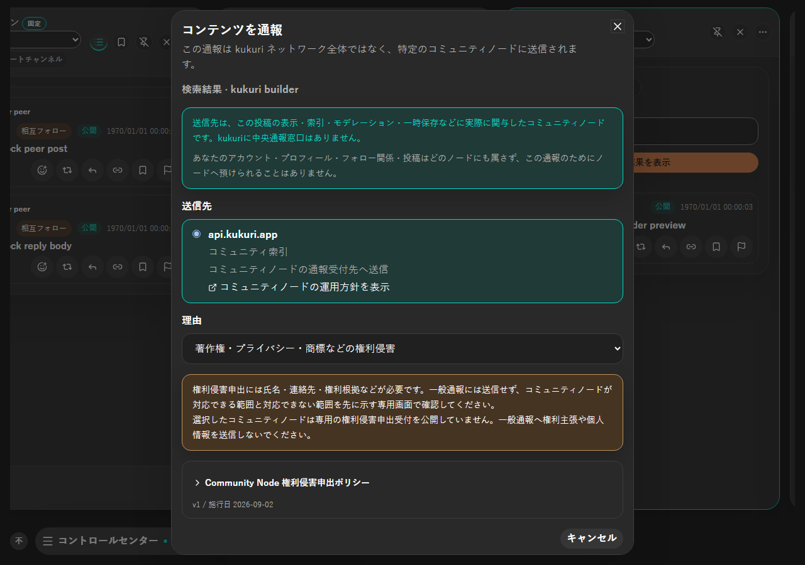 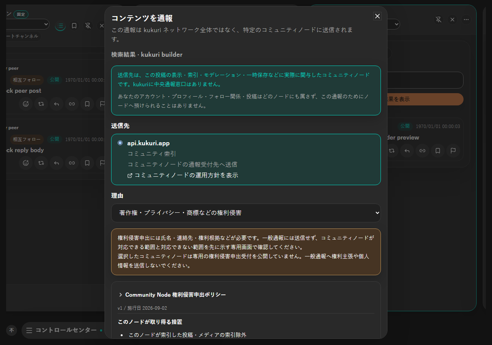 |

変更前の同意 Dialog は、7 文書が slug 昇順で並び、それぞれに必須または任意のバッジが付いていた。利用規約は末尾、プライバシーポリシーは 5 番目だった。変更後は先頭 2 件が利用規約とプライバシーポリシーで、バッジは更新時だけ出る。権利侵害申出ポリシーは一覧から消え、権利侵害を申し出る画面で読める。

## Accessibility・性能・未確認事項

権利侵害申出ポリシーの開閉ボタンは見出し要素の中に置き、`aria-expanded` と、開いているときだけ `aria-controls` を持つ。同意 Dialog の見出し行は accessible description に版と同意状況を結ぶ形を維持し、外したのはバッジ 2 種だけとした。コントロールセンターのノード一覧は list / listitem で、各ボタンの accessible name にノード名を含める（`{{node}} の規約と同意状況を開く`）。Dialog を閉じると、開いた行のボタンへ focus が戻ることを Vitest で確認した。Escape は手前の Dialog だけを閉じ、コントロールセンターは開いたままにする（独立監査で、両方閉じて戻り先を失う挙動を指摘され、失敗 test で再現してから直した）。「見つける」カラムはカード見出しを外した後もカラム見出しとタブ一覧（`role="tablist"`、aria-label あり）で位置が分かる。

権利侵害申出ポリシーは、通報画面で理由に権利侵害を選んだときだけ取得し、閉じると破棄する。polling は無い。コントロールセンターのノード一覧は既に store にある設定・状態・manifest から描画し、追加の取得はしない。

視覚回帰 baseline（Linux / Chromium）は「Kukuri Visual Baseline」workflow で再生成した（10 面。「見つける」カラムの見出し削除が、既定 deck を含む面へ波及したため）。

未確認: Windows WebView2 と Ubuntu WebKitGTK の実機描画、screen reader の実際の読み上げ、200% zoom、Windows High Contrast、物理タッチ入力、en / zh-CN の撮影。本番コミュニティノードでの `policy_kind` 付き応答は未反映で、反映確認は別 Issue とする。

## Review result

- 一貫性: 初回起動・設定・見つける・コントロールセンターが同じ Dialog を使い、どの導線でも同じ一覧・同じ順序になる。
- エラー防止: 表示していない文書を同意記録に入れない。必須文書は kind に関わらず一覧に残す。
- 記憶負荷: 接続の同意で読む文書と、申し出るときに読む文書を分けた。
- 安全性: 権利侵害申請モーダルのポリシー表示は読み取りのみで、申出送信と `scope_acknowledged` は従来どおり外部の申出画面が担う。

## Exceptions

None。必要な確認の未実施は「未確認事項」に記載した。
