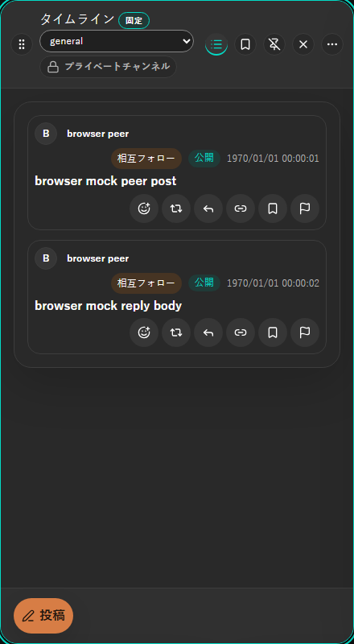
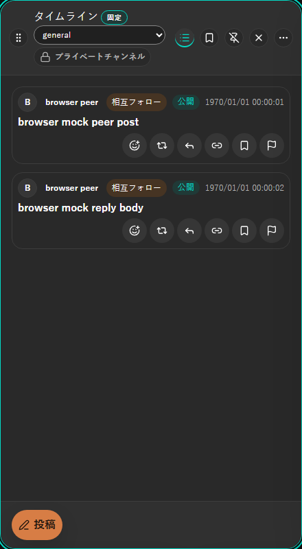
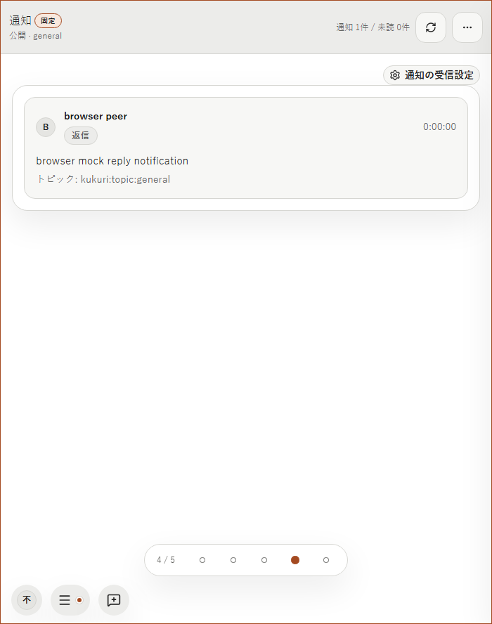
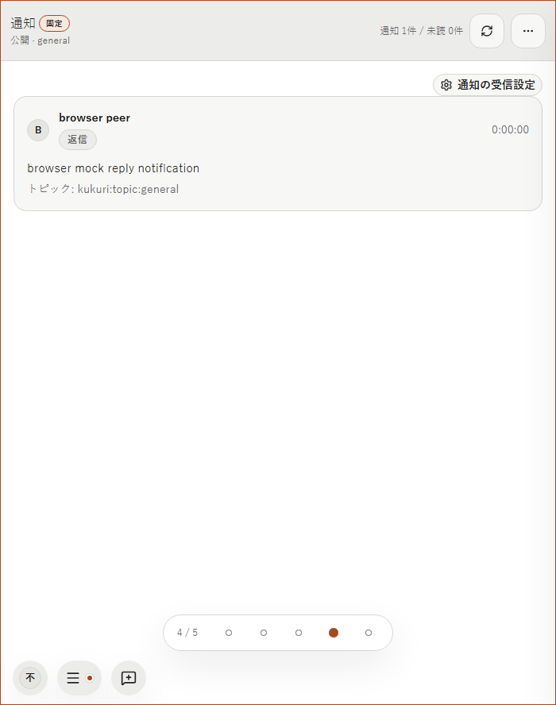
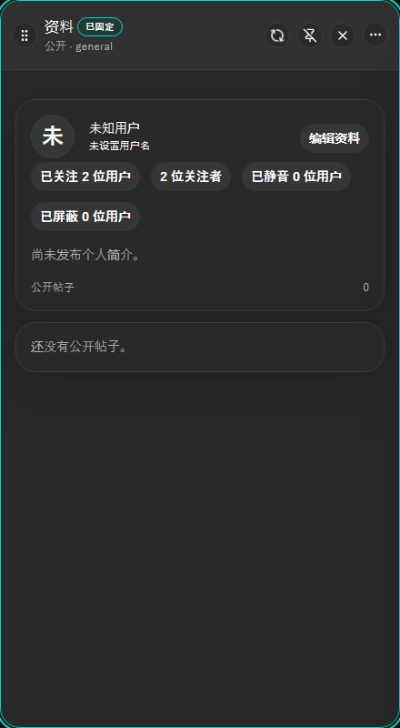
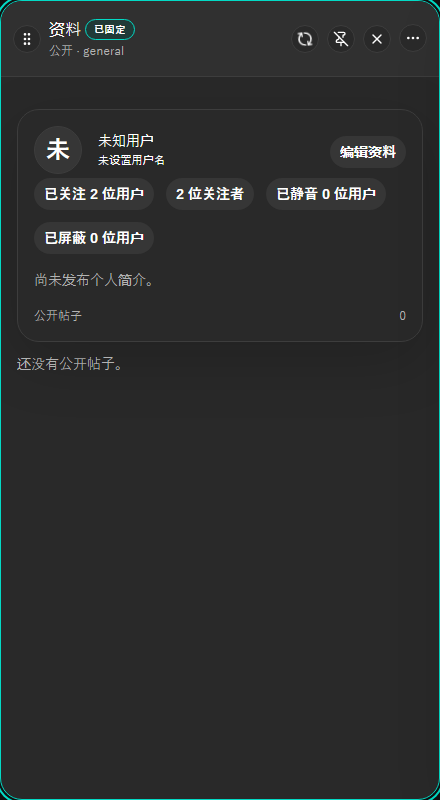

# カラム本文を包むだけの枠を外す

- Status: current
- Supersedes: None
- Superseded by: None
- PR: 未作成（作成後に追記する）
- Issue / Scope revision: [#1271](https://github.com/kukuri-app/kukuri/issues/1271)、Scope revision 1（2026-09-21。対象を同じ枠を使う他のカラムへ拡張し、Metaverse の枠は残すと確定）
- 対象: カラムで投稿・通知・会話・検索を読む利用者。カラムの外枠の一段内側にある、本文全体を包むだけの枠を外し、一覧をカラム本文へ直接並べる。

## 採用した判断

カラム本文、またはその主な一覧を包むだけの `.panel`（線・角丸・padding・影）は置かない。一覧や本文はカラム本文へ直接並べ、左右の余白はカラム本文の padding（16px）だけにする。DESIGN.md の「過剰な card nesting を避ける」と「Column 本文の左右 padding を内側の stack で再度差し引かない」を、カラム本文の外側の層に適用した判断である。

枠の無い grid の stack は `.shell-column-content` とする。区画を仕切る枠が要る場合だけ `.shell-workspace-card` を `Card` と併用する。

- 外した: タイムライン（フィード・ブックマーク）、通知、プロフィール（自分）の投稿一覧、投稿者詳細の投稿一覧、メッセージ一覧、会話、ライブ（見出しと一覧）、見つける
- 残した: Metaverse の部屋の発見・3D stage・接続。1 つのカラムの中の別々の区画を仕切る枠で、stage には immersive / fullscreen の CSS がかかる。内容そのものであるカード（投稿カード、通知項目、プロフィール概要、投稿者詳細、`panel-subsection` の各 panel、ブックマークの空状態の案内）、設定・ダイアログの `Card` も残す。

| 修正前 | 修正後 |
| --- | --- |
|  |  |
|  |  |
|  |  |

## 条件と証跡

- Browser: Chromium（Playwright、`VITE_KUKURI_DESKTOP_MOCK`）。8 カラム × 1400px / 700px × dark / light × ja / en、プロフィールは zh-CN も追加。Metaverse は en の 2 条件で、変わらないことを確認した。
- 計測: 対象の一覧の左右端とカラム本文の内容領域の差は、修正前は全条件で 17px（線 1px + padding 16px）、修正後は 0px。カラム本文と document に横 scroll は無い。Metaverse の値は修正前後で同じ。
- Vitest: `DesktopShellPage.columnBodyFrame.test.tsx` の 9 件は、修正前に 9 件すべてが「`.panel` に包まれている」ことで失敗し、修正後にすべて成功した。
- Visual: baseline は GitHub Actions の Linux / Chromium で再生成する。Windows では snapshot を比較しない。

## Accessibility・性能・未確認事項

見出しを持つメッセージ一覧とライブの見出しは `section` のまま、その他は `div` にした。見出しの階層、accessible name、focus 順、操作の対象は変えていない。取得・描画の量は変わらず、要素を 1 つ置き換えただけなので、性能の計測は行わない。

Tauri / WebView の実機では確認していない。変更は一覧を包む要素と CSS だけで、media の再生・fullscreen・入力の奪い合いには触れないため、browser での確認までとした。screen reader と touch 実機の適合は主張しない。
